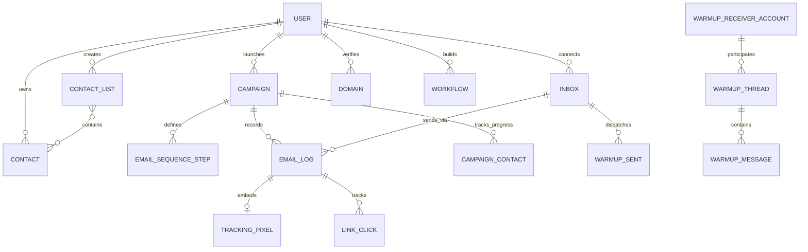
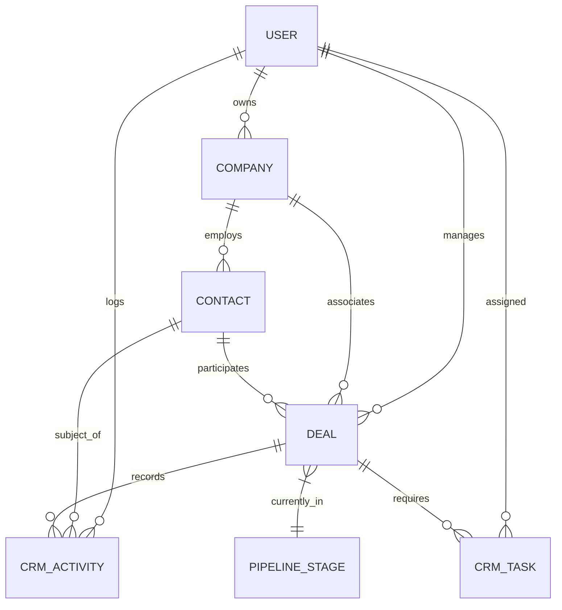
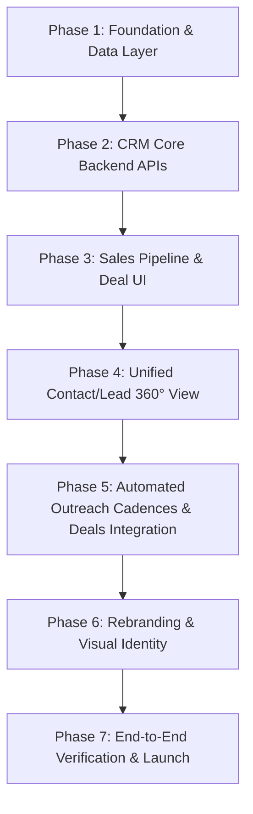

# EMAREACH ARCHITECTURE AUDIT & CRM FOUNDATION BLUEPRINT

**Document Version:** 1.0.0  
**Repository:** `https://github.com/ritik-prog/emareach.git`  
**License:** MIT  
**Analysis Date:** March 2026  
**Auditor:** Senior Full-Stack Software Architect & Systems Analyst  

---

## 1. Executive Summary

EmaReach is a production-grade, asynchronous cold email outreach, deliverability, and mailbox warm-up platform architected as a monorepo containing:
1. A **FastAPI** Python backend (`emareach-backend`) with 39 route modules, 306+ REST API endpoints, 48 backend service modules, in-process async background workers, and Motor/MongoDB 7 persistence.
2. A **Next.js 16 / React 19 / Tailwind CSS v4** customer-facing web application & marketing site (`emareach-frontend-next`) containing 139 routes/pages, rich visual builders (GrapesJS, ReactFlow, TipTap), and TanStack Query state orchestration.
3. An internal **Next.js 16 / React 19** administration console (`emareach-admin-panel`) containing 44 routes/pages for user administration, subscription plan configuration, platform warmup receiver pool operations, automated system job execution, billing webhook tracking, and AWS infrastructure control.
4. **Terraform & Caddy** Infrastructure-as-Code (`infrastructure/`) targeting AWS (EC2 Auto-Scaling Groups, Application Load Balancers, ECR container registries, IAM role-based policies, and SSM Parameter Store secrets management).

### Key Architectural Verdict for Outreach + CRM Platform
The EmaReach codebase provides an exceptionally strong, battle-tested foundation for a combined **Cold Email Outreach + Company CRM Platform**. The core email dispatch engine, multi-inbox rotation algorithms, IMAP/SendGrid reply detection mechanisms, AI personalization pipelines, and MongoDB schemas already implement ~70% of the cold outreach and activity logging machinery required by a modern sales CRM. By augmenting the database with unified `leads`, `companies`, `deals/opportunities`, `pipeline_stages`, and `crm_activities` collections (while linking to existing `contacts`, `campaigns`, and `email_logs`), we can build an enterprise-grade Outreach + CRM platform without reinventing core email infrastructure.

---

## 2. Repository Structure

```
.
├── .env.example                            # Root docker-compose configuration knobs
├── .gitattributes                          # Git line-ending / attribute rules
├── .gitignore                              # Monorepo root ignore rules
├── CONTRIBUTING.md                         # Developer workflow & PR guidelines
├── docker-compose.yml                      # 4-service stack: mongo, backend, frontend, admin
├── LICENSE                                 # MIT License
├── README.md                               # Project documentation & setup overview
├── SECURITY.md                             # Vulnerability reporting & secret guidelines
│
├── emareach-backend/                       # FastAPI REST API & Background Daemon
│   ├── .env.example                        # Comprehensive environment secrets template (151 lines)
│   ├── admin_models.py                     # Pydantic models for admin RBAC, rules, jobs, audit logs
│   ├── config.py                           # Global retention & blocking threshold constants
│   ├── create_admin.py                     # CLI script to bootstrap initial super-admin
│   ├── database.py                         # Motor async client (db & admin_db dual database handles)
│   ├── Dockerfile                          # Python 3.12-slim container definition
│   ├── models.py                           # Core Pydantic models for outreach, warmup, billing, users
│   ├── requirements.txt                    # Python dependencies
│   ├── server.py                           # FastAPI application entrypoint, CORS, indexes & lifespan
│   ├── routes/                             # 39 Route Modules (306+ Endpoints)
│   ├── services/                           # 48 Core Service Modules
│   │   └── support-bot/                    # ChromaDB Vector Store & RAG Engine
│   ├── scripts/                            # Operational & migration utilities (11 scripts)
│   └── tests/                              # Unit tests for enrichment, metering, lifecycle, warmup
│
├── emareach-frontend-next/                 # Next.js 16 Customer App & Marketing Website
│   ├── app/                                # App Router (139 routes)
│   │   ├── (app)/                          # Authenticated Customer Dashboard
│   │   ├── (auth)/                         # Authentication routes (login, signup, 2FA OTP, reset)
│   │   ├── (marketing)/                    # SEO marketing landing pages, pricing, tools, blogs
│   │   ├── api/                            # Next.js Server-Side API proxies & contact form handlers
│   │   ├── globals.css                     # Tailwind CSS v4 design system, color variables, themes
│   │   └── layout.tsx                      # Root layout, theme provider, react-query provider
│   ├── components/                         # 100+ reusable UI components (Radix UI primitives)
│   ├── contexts/                           # React contexts (AuthContext, DemoContext, ThemeContext)
│   ├── hooks/                              # Custom React hooks (useAuth, useCampaigns, useAnalytics)
│   └── lib/                                # API client (fetch wrapper with cookie/header token logic)
│
├── emareach-admin-panel/                   # Next.js 16 Internal Super-Admin Console
│   ├── app/                                # Admin App Router (44 routes)
│   │   └── admin/                          # Admin sub-routes (users, campaigns, inboxes, warmup, etc.)
│   ├── components/                         # Admin UI components, layout sidebars, metric cards
│   └── lib/                                # Axios admin API client (reads admin_auth_token)
│
└── infrastructure/                         # Production Infrastructure as Code
    ├── caddy/                              # Caddyfile for automatic TLS & custom tracking domain proxy
    └── terraform/                          # AWS Deployment Modules (EC2, ALB, ECR, IAM, SSM)
```

---

## 3. Technology Stack

| Domain | Technology / Library | Version | Role in System |
|---|---|---|---|
| **Backend Runtime** | Python | 3.12.10 | Core API runtime |
| **Backend Framework** | FastAPI | 0.135.3 | High-performance async REST API engine |
| **ASGI Server** | Uvicorn | 0.25.0 | Async server with multi-worker support |
| **Database Driver** | Motor / PyMongo | 3.3.1 / 4.5.0 | Async MongoDB driver |
| **Data Validation** | Pydantic | 2.12.5 | Request/Response schema validation & serialization |
| **Security & Auth** | Passlib (Bcrypt) & Python-Jose | 1.7.4 / 3.5.0 | Password hashing (Bcrypt 4.0.1) & HS256 JWT tokens |
| **Secret Encryption** | Cryptography (Fernet) | >=2.5,<46 | 256-bit AES-CBC symmetric encryption for stored secrets |
| **Email Protocol (SMTP)** | smtplib / aiosmtplib (via asyncio) | Native | Async SMTP email dispatching |
| **Email Protocol (IMAP)** | imaplib (asyncio thread executor) | Native | Background IMAP inbox sync & reply detection |
| **DNS Resolution** | dnspython & dkimpy | 2.8.0 / 1.1.1 | DNS record validation (SPF, DKIM, DMARC, MX) |
| **AI / LLMs** | Groq Python SDK / OpenAI / LiteLLM | 1.0.0 / 1.99.9 | Fast LLaMA 3.3-70b email generation & warmup dialogue |
| **Vector DB / RAG** | ChromaDB & Sentence-Transformers | 0.5.4 / 3.0.1 | Support bot embeddings & semantic search |
| **Search Engine** | Serper.dev REST API | httpx 0.28.1 | Google search scraping for Smart Leads enrichment |
| **Frontend Framework** | Next.js | 16.1.6 | Full-stack React framework (App Router, SSR, API routes) |
| **Frontend UI Library** | React & React DOM | 19.2.3 | Modern React 19 UI component library |
| **CSS & Styling** | Tailwind CSS & PostCSS | 4.0.0 | Utility-first styling with CSS custom properties |
| **Component Primitives**| Radix UI | Latest | Unstyled, accessible UI components (Dialogs, Menus, Tabs) |
| **Icons** | Lucide React | 0.462.0 | Consistent iconography |
| **State & Data Fetching**| TanStack React Query | 5.83.0 | Server-state caching, optimistic updates, query invalidation|
| **Form Management** | React Hook Form + Zod | 7.61.1 / 3.25 | Type-safe form validation |
| **Visual Builders** | ReactFlow, TipTap, GrapesJS | Latest | Workflow canvas, WYSIWYG editor, Drag-and-drop HTML |
| **Data Persistence** | MongoDB Community / Atlas | 7.0+ | Document database for all platform state |
| **Reverse Proxy / TLS** | Caddy | 2.8+ | Automatic Let's Encrypt SSL & custom domain CNAME proxy |
| **Cloud Infrastructure**| Terraform | 1.5+ | AWS EC2, ALB, ECR, IAM, and SSM Parameter Store IaC |

---

## 4. How to Run Locally

### Prerequisites
- **Python 3.12+** (Installed: `Python 3.12.10`)
- **Node.js 20+** (Installed: `v26.8.1`, `npm 11.19.0`)
- **MongoDB 7.0+** (Local instance or Docker container or MongoDB Atlas URI)
- **Docker & Docker Compose** (Optional: Docker 29.6.1 installed)

### Safe Local Development Setup (Without Docker)

#### 1. Setup Backend
```bash
cd emareach-backend
python -m venv .venv
# On Windows:
.venv\Scripts\activate
# On Linux/macOS:
source .venv/bin/activate

pip install -r requirements.txt
cp .env.example .env
```
Generate an encryption key:
```bash
python -c "from cryptography.fernet import Fernet; print(Fernet.generate_key().decode())"
```
Edit `emareach-backend/.env` with minimal required development variables:
```env
MONGO_URL=mongodb://localhost:27017
DB_NAME=emareach_ai
JWT_SECRET=local-dev-jwt-secret-key-32-chars-min
ENCRYPTION_KEY=<generated_fernet_key>
FRONTEND_URL=http://localhost:8080
BACKEND_URL=http://localhost:8001
CORS_ORIGINS=http://localhost:8080,http://localhost:3000,http://localhost:8082
ALLOW_DEV_CREATE_ADMIN=true
SKIP_BACKGROUND_TASKS=1   # Set to 1 to disable 60s background loops in local dev
```
Run backend server:
```bash
uvicorn server:app --reload --port 8001
```
Verify health:
```bash
curl http://localhost:8001/api/health
# Response: {"status":"healthy","database":"connected","version":"1.0.0"}
```

#### 2. Bootstrap Initial Admin User
```bash
python create_admin.py --email admin@example.com --password AdminSecurePassword123!
```

#### 3. Setup Frontend App
```bash
cd ../emareach-frontend-next
npm install
cp .env.example .env.local
```
Edit `emareach-frontend-next/.env.local`:
```env
NEXT_PUBLIC_API_URL=http://localhost:8001/api
NEXT_PUBLIC_SITE_URL=http://localhost:8080
```
Run frontend:
```bash
npm run dev
# Running on http://localhost:8080 (or port 3000 if not specified)
```

#### 4. Setup Admin Panel
```bash
cd ../emareach-admin-panel
npm install
cp .env.example .env.local
```
Edit `emareach-admin-panel/.env.local`:
```env
NEXT_PUBLIC_API_URL=http://localhost:8001/api
NEXT_PUBLIC_MAIN_SITE_URL=http://localhost:8080
```
Run admin panel:
```bash
npm run dev -- -p 8082
# Running on http://localhost:8082
```

---

## 5. Environment Variables & External Dependencies

### Backend Variables Analysis (`emareach-backend/.env`)

| Variable | Mandatory for Local Dev? | Mandatory for Prod? | Default / Example Value | Description |
|---|---|---|---|---|
| `MONGO_URL` | **YES** | **YES** | `mongodb://localhost:27017` | MongoDB connection URI |
| `DB_NAME` | **YES** | **YES** | `emareach_ai` | Main database name |
| `ADMIN_DB_NAME` | NO | Optional | `emareach_admin` | Admin database name (defaults to `DB_NAME` if omitted) |
| `JWT_SECRET` | **YES** | **YES** | `change-in-prod-secret` | HS256 secret for signing user & admin tokens |
| `ENCRYPTION_KEY` | **YES** | **YES** | `<Fernet_Key>` | Fernet key for encrypting OAuth tokens & SMTP passwords |
| `FRONTEND_URL` | **YES** | **YES** | `http://localhost:8080` | Public URL for customer frontend |
| `BACKEND_URL` | **YES** | **YES** | `http://localhost:8001` | Public API URL |
| `CORS_ORIGINS` | **YES** | **YES** | `http://localhost:8080,http://localhost:8082` | Allowed CORS origins |
| `GOOGLE_CLIENT_ID` | NO | For Gmail OAuth | `xxx.apps.googleusercontent.com` | Google Cloud OAuth Client ID |
| `GOOGLE_CLIENT_SECRET` | NO | For Gmail OAuth | `GOCSPX-xxx` | Google Cloud OAuth Client Secret |
| `GOOGLE_REDIRECT_URI` | NO | For Gmail OAuth | `http://localhost:8001/api/gmail/callback` | OAuth redirect URI |
| `MICROSOFT_CLIENT_ID` | NO | For Outlook OAuth | `azure-app-uuid` | Microsoft Azure AD App Client ID |
| `MICROSOFT_CLIENT_SECRET` | NO | For Outlook OAuth | `secret-value` | Microsoft Azure AD Client Secret |
| `MICROSOFT_REDIRECT_URI` | NO | For Outlook OAuth | `http://localhost:8001/api/admin/warmup/outlook-receiver/callback` | Outlook OAuth redirect |
| `GROQ_API_KEY` | NO | For AI Features | `gsk_xxx` | Groq API Key for LLaMA 3.3 email generation & warmup |
| `SERPER_API_KEY` | NO | For Smart Leads | `serper_key_xxx` | Serper Google Search API for lead discovery & web scraping |
| `SENDGRID_API_KEY` | NO | For SendGrid Outbound | `SG.xxx` | SendGrid transactional & campaign delivery API key |
| `NOTIFICATION_FROM_EMAIL` | NO | For App Emails | `notifications@yourcompany.com` | Sender for verification OTPs & alerts |
| `NOTIFICATION_SMTP_HOST` | NO | If SMTP used for OTPs | `smtp.mailgun.org` | Fallback SMTP host for system notifications |
| `RAZORPAY_KEY_ID` | NO | For Indian Billing | `rzp_test_xxx` | Razorpay API key |
| `RAZORPAY_KEY_SECRET` | NO | For Indian Billing | `rzp_secret_xxx` | Razorpay secret |
| `LEMONSQUEEZY_API_KEY` | NO | For Global Billing | `lms_xxx` | Lemon Squeezy API key |
| `LEMONSQUEEZY_STORE_ID` | NO | For Global Billing | `12345` | Lemon Squeezy Store ID |
| `SLACK_BOT_TOKEN` | NO | For Admin Alerts | `xoxb-xxx` | Slack bot token for support notifications |
| `TRACKING_BASE_URL` | NO | For Branded Tracking | `https://track.yourdomain.com` | Tracking base URL for open pixel & click redirect |

---

## 6. Backend Architecture

### Application Lifespan (`server.py`)
- **Startup:** Automatically provisions 54+ compound indexes across MongoDB collections (`users`, `contacts`, `campaigns`, `email_logs`, `domains`, `inboxes`, `workflows`, etc.).
- **Data Migrations on Startup:**
  - `_migrate_gmail_credentials_to_multi()`: Upgrades legacy single-account Gmail credentials to multi-inbox collections.
  - `_migrate_warmup_send_templates_to_paired()`: Migrates separate subject/body templates to paired conversation structures.
  - `_backfill_domain_normalized()`: Canonicalizes domain strings (lowercased, stripped trailing dots).
- **Background Task Supervisor:** Initializes `BackgroundTasks` containing:
  - 60-second automation tick (campaign batch runner, scheduled steps, ramp-up volume checks).
  - 5-minute warmup sender loop (generates multi-turn threads using Groq LLaMA 3.3).
  - 10-minute warmup receiver sync (logs into receiver accounts via IMAP, detects messages, marks unread/starred, dispatches AI replies).
  - 24-hour cleanup cron (purges stale email logs past 60 days, blocked contacts past 7 days).

### Service Architecture Matrix
```
                              ┌────────────────────────────────────────┐
                              │             FastAPI Router             │
                              │          (routes/*.py - 39 modules)    │
                              └───────────────────┬────────────────────┘
                                                  │
                ┌─────────────────────────────────┼─────────────────────────────────┐
                ▼                                 ▼                                 ▼
   ┌─────────────────────────┐       ┌─────────────────────────┐       ┌─────────────────────────┐
   │    Outreach & Email     │       │   Warmup & Deliverability│      │    Lead Intelligence    │
   │  services/email_service │       │  services/warmup_*      │       │  services/smart_leads_* │
   │  services/smtp_service  │       │  services/dns_provider  │       │  services/enrichment_*  │
   │  services/gmail_service │       │  services/rampup        │       │  services/llm_service   │
   └────────────┬────────────┘       └────────────┬────────────┘       └────────────┬────────────┘
                │                                 │                                 │
                └─────────────────────────────────┼─────────────────────────────────┘
                                                  ▼
                              ┌────────────────────────────────────────┐
                              │        Database & Security Layer       │
                              │  database.py (Motor async MongoDB)     │
                              │  encryption_helper.py (Fernet 256-bit) │
                              │  auth_utils.py (JWT + Bcrypt)          │
                              └────────────────────────────────────────┘
```

---

## 7. Frontend Architecture

### Technology & Structure
- **Next.js 16 (App Router)** utilizing React 19 server and client components.
- **Tailwind CSS v4** with a comprehensive CSS custom properties token system defined in `globals.css` (supporting seamless light/dark modes).
- **Authentication Flow:** Dual-strategy support. The frontend stores the JWT in an `httpOnly` secure cookie (`auth_token`) and also maintains it in memory / React context. All Next.js server proxies forward authentication cookies seamlessly to FastAPI.
- **State Management:**
  - `@tanstack/react-query` handles all server-state caching, background refetching, and cache invalidation.
  - React Contexts manage global UI state: `AuthContext` (session user profile, workspace permissions), `DemoContext` (read-only interactive demo mode), and `ThemeContext` (dark/light theme switching).
- **Interactive Visual Engines:**
  - **Workflows:** `reactflow` graph canvas for node-based automation design.
  - **Campaign Email Studio:** `TipTap` rich text editor and `GrapesJS` newsletter HTML drag-and-drop designer.
  - **Analytics:** `recharts` for deliverability rate visualizations, daily volume bar charts, and A/B test conversion funnels.

---

## 8. Admin Panel Architecture

The Admin Panel (`emareach-admin-panel`) is completely decoupled from the customer frontend and is designed for operations, compliance, and infrastructure management.

### Key Capabilities
1. **User Administration:** Full visibility into all registered tenants, plan assignments, monthly email quotas, active domain counts, and instant single-click user impersonation (`/auth/impersonate`).
2. **Warmup Receiver Pool Management:** Configuration of central IMAP/SMTP accounts (Google, Outlook, Yahoo) that automatically receive, star, and reply to client warmup emails.
3. **Billing Webhook Ledger & Replay:** Logs raw incoming webhook events from Razorpay and Lemon Squeezy with cryptographic signature verification and manual replay capability for failed webhooks.
4. **AWS Infrastructure Controls:** Direct integration with AWS Auto Scaling Groups (ASG) allowing administrators to trigger rolling instance redeployments, monitor EC2 instance health, and inspect instance lifecycle states.
5. **System Automation & Error Monitoring:** Global error log aggregation with stack trace inspection and automated system job execution.

---

## 9. Database Architecture & Complete Entity Analysis

The platform uses **MongoDB** via the async `Motor` library, separating application data (`db`) from admin system data (`admin_db`).



### Complete Entity Catalog

#### 1. Entity: `User` (`db.users`)
- **Fields:** `id` (str/uuid), `email` (EmailStr), `password_hash` (str), `first_name` (str), `last_name` (str), `company` (str), `status` (str: active/banned/pending), `plan_id` (str), `subscription_status` (str: active/trial/past_due/cancelled), `trial_ends_at` (datetime), `subscription_start` (str), `subscription_end` (str), `billing_last_paid_at` (datetime), `billing_has_successful_subscription_charge` (bool), `razorpay_customer_id` (str), `razorpay_subscription_id` (str), `lemon_squeezy_customer_id` (str), `lemon_squeezy_subscription_id` (str), `email_verified` (bool), `two_fa_enabled` (bool), `extra_max_domains` (int), `extra_max_subdomains` (int), `extra_max_google_accounts` (int), `extra_max_campaigns` (int), `extra_max_monthly_smtp_emails` (int), `credits_balance` (int), `warmup_shared_pool_enabled` (bool), `created_at` (datetime), `updated_at` (datetime).
- **Relationships:** Referenced by `contacts.user_id`, `campaigns.user_id`, `inboxes.user_id`, `domains.user_id`, `email_logs.user_id`, `workflows.user_id`.
- **CRUD Operations:** Created at signup (`routes/auth.py`); Updated on profile edit, plan upgrades, webhook payments, password resets; Read on every authenticated request.
- **Potential Reuse for CRM:** Direct mapping to CRM Tenant / Account Owner.

#### 2. Entity: `Contact` (`db.contacts`)
- **Fields:** `id` (str/uuid), `user_id` (str), `email` (EmailStr), `first_name` (str), `last_name` (str), `company` (str), `industry` (str), `custom_fields` (Dict[str, Any]), `status` (str: pending/sent/opened/clicked/replied/unsubscribed/blocked), `manual_unblock` (bool), `created_at` (datetime).
- **Relationships:** Belongs to `User`. Referenced in `ContactList.contact_ids`, `CampaignContact.contact_id`, `EmailLog.contact_id`.
- **CRUD Operations:** Created via CSV/Excel upload or single contact creation (`routes/contacts.py`); Updated on campaign send, open, click, reply, or bounce; Read during campaign batch execution and contact list views.
- **Potential Reuse for CRM:** Direct foundation for CRM `Lead` / `Contact Person`. Already contains custom fields, engagement status, and company attributes.

#### 3. Entity: `ContactList` (`db.contact_lists`)
- **Fields:** `id` (str/uuid), `user_id` (str), `name` (str), `description` (str), `contact_ids` (List[str]), `created_at` (datetime), `updated_at` (datetime).
- **Relationships:** Belongs to `User`; contains list of `Contact.id` references. Referenced by `Campaign.contact_list_ids`.
- **Potential Reuse for CRM:** Direct reuse for CRM Lead Segments, Static Lists, and Target Audience Groups.

#### 4. Entity: `Campaign` (`db.campaigns`)
- **Fields:** `id` (str/uuid), `user_id` (str), `name` (str), `daily_limit` (int), `sender_name` (str), `template_ids` (List[str]), `contact_list_ids` (List[str]), `contact_ids` (List[str]), `status` (str: draft/active/paused/completed), `ai_prompt` (str), `ai_provider` (str), `use_ai_generation` (bool), `ai_generation_prompt` (str), `use_external_enrichment` (bool), `external_enrichment_prompt` (str), `field_mapping` (Dict[str, str]), `email_sequence` (List[EmailSequenceStep]), `start_date` (str), `start_time` (str), `end_time` (str), `timezone` (str), `sender_type` (str: gmail/smtp), `sender_ids` (List[str]), `sender_rotation` (str: round_robin/random), `rotation_enabled` (bool), `reply_to_type` (str), `reply_to_id` (str), `reply_to_email` (str), `ab_winner_template_id` (str), `open_tracking` (bool), `schedule_weekdays` (List[int]), `created_at` (datetime), `updated_at` (datetime).
- **Relationships:** Belongs to `User`. References `inboxes`, `contact_lists`, `templates`. Creates `email_logs`, `campaign_contacts`.
- **Potential Reuse for CRM:** Direct reuse as CRM Outreach Sequences and Automated Sales Cadences.

#### 5. Entity: `EmailLog` (`db.email_logs`)
- **Fields:** `id` (str/uuid), `user_id` (str), `campaign_id` (str), `contact_id` (str), `template_id` (str), `gmail_message_id` (str), `gmail_thread_id` (str), `subject` (str), `body` (str), `status` (str: pending/sent/failed/opened/clicked/replied), `sent_at` (datetime), `opened_at` (datetime), `clicked_at` (datetime), `replied_at` (datetime), `reply_type` (str: human/auto/outbound), `tracking_pixel_id` (str), `error_message` (str), `reply_body` (str), `created_at` (datetime).
- **Relationships:** Links `User`, `Campaign`, `Contact`, `Inbox`. Has one `TrackingPixel`, multiple `LinkClick`.
- **Potential Reuse for CRM:** Direct reuse as the CRM Email Interaction History & Activity Timeline.

#### 6. Entity: `Inbox` (`db.inboxes`)
- **Fields:** `id` (str/uuid), `user_id` (str), `domain_id` (str), `subdomain_id` (str), `email` (EmailStr), `sender_type` (str: gmail/smtp), `smtp_host` (str), `smtp_port` (int), `smtp_username` (str), `smtp_password` (str - Fernet encrypted), `smtp_provider` (str: custom/sendgrid/emareach), `gmail_credentials_id` (str), `gmail_auth_method` (str: oauth/app_password), `auto_warmup` (bool), `warmup_progress` (int 0-100), `campaign_rampup` (bool), `daily_limit` (int max 50), `sent_today` (int), `status` (str: warming/ready/paused), `warmup_engagement_mode` (str: pool/network/hybrid), `created_at` (datetime), `updated_at` (datetime).
- **Relationships:** Belongs to `User`, optional link to `Domain`. Used by `EmailService` and `WarmupSenderService`.
- **Potential Reuse for CRM:** Direct reuse for Sales Rep Mailbox Connections and Sending Accounts.

#### 7. Entity: `Domain` (`db.domains`) & `Subdomain` (`db.subdomains`)
- **Fields:** `id` (str/uuid), `user_id` (str), `domain` (str), `domain_normalized` (str), `status` (str: pending/verified/failed), `spf_verified` (bool), `dkim_selector` (str), `dkim_verified` (bool), `dmarc_verified` (bool), `cname_verified` (bool), `mx_verified` (bool), `health_score` (int 0-100), `inbound_parse_enabled` (bool), `tracking_domain` (str), `tracking_domain_verified` (bool), `sending_provider` (str: sendgrid/email_infra), `created_at` (datetime).
- **Potential Reuse for CRM:** Direct reuse for Company Sending Domains and Custom Tracking Hostnames.

#### 8. Entity: `Workflow` (`db.workflows`), `WorkflowRun`, `WorkflowRunStep`
- **Fields:** `id`, `user_id`, `name`, `trigger` (WorkflowTrigger), `nodes` (List[WorkflowNode]), `edges` (List[WorkflowEdge]), `status` (draft/active/paused).
- **Potential Reuse for CRM:** Direct foundation for CRM Deal Stage Automations, Lead Routing, and SLA Triggers.

#### 9. Entity: `SmartLeadsRun` (`db.smart_leads_runs`), `SmartLeadsCompany`, `SmartLeadsPerson`, `SmartLeadsEmail`
- **Fields:** Complete SERP search parameters, scraped web pages, extracted executive names, verified emails, and confidence scores.
- **Potential Reuse for CRM:** Automated Lead Generation & Prospecting Engine built directly into the CRM.

---

## 10. Complete API Inventory Summary

The backend exposes **306 REST endpoints** categorized below:

| API Category | Router File | Endpoint Count | Auth Method | Primary Services Used | CRM Reuse Assessment |
|---|---|---|---|---|---|
| **AUTH** | `routes/auth.py`, `auth_utils.py` | 18 | Public / JWT / 2FA OTP | `Passlib`, `Python-Jose`, `NotificationService` | **100% Reusable** for CRM user auth & sessions |
| **USERS / WORKSPACE**| `routes/workspace.py` | 6 | User JWT | `db.users`, `db.sub_user_invitations` | **100% Reusable** for CRM sales team permissions |
| **CONTACTS** | `routes/contacts.py`, `contact_lists.py` | 16 | User JWT | `ExcelService`, `ZeroBounce`, `db.contacts` | **100% Reusable** as CRM Contact/Lead directory |
| **CAMPAIGNS** | `routes/campaigns.py` | 24 | User JWT | `EmailService`, `AutomationService`, `CampaignRampup`| **100% Reusable** for CRM multi-touch sales cadences |
| **TEMPLATES** | `routes/templates.py` | 5 | User JWT | `db.templates`, `TipTap`, `GrapesJS` | **100% Reusable** for Sales Email Templates |
| **INBOXES** | `routes/inboxes.py`, `mailbox_routes.py` | 19 | User JWT / Mailbox JWT | `GmailService`, `SMTPService`, `ImapReplyService` | **100% Reusable** for Sales Rep Mailbox integration |
| **EMAIL / DISPATCH** | `routes/emails.py`, `inbox_emails.py` | 14 | User JWT | `EmailService`, `SendGridService`, `SMTPService` | **100% Reusable** for manual & automated sending |
| **TRACKING** | `routes/tracking.py` | 8 | Public (Pixel/Redirect) | `TrackingService`, `LifecycleAutomationService` | **100% Reusable** for CRM engagement activity tracking |
| **WARMUP** | `routes/warmup.py` | 18 | User JWT | `WarmupSenderService`, `WarmupReceiverService` | **100% Reusable** for Domain & Mailbox health |
| **ANALYTICS** | `routes/analytics.py` | 7 | User JWT | `db.email_logs`, `db.campaigns` | **100% Reusable** for Sales Outreach KPI dashboards |
| **DOMAINS / DNS** | `routes/domains.py`, `subdomains.py` | 15 | User JWT | `DNSProviderService`, `SendGridService` | **100% Reusable** for Domain deliverability setup |
| **AI GENERATION** | `routes/llm.py`, `outreach.py` | 12 | User JWT | `LLMService`, `Groq`, `OpenAI` | **100% Reusable** for AI Sales Email personalization |
| **LEAD SEARCH (SMART LEADS)**| `routes/smart_leads.py` | 7 | User JWT | `SmartLeadsPipeline`, `Serper`, `LLMService` | **100% Reusable** for Prospect finding & enrichment |
| **WORKFLOWS** | `routes/workflows.py` | 11 | User JWT | `WorkflowService`, `db.workflows` | **100% Reusable** for CRM pipeline & lead automations |
| **BILLING** | `routes/billing.py`, `plans.py` | 14 | User JWT / Webhook HMAC | `RazorpayService`, `LemonSqueezyService` | **Reusable** or configurable depending on billing model |
| **ADMIN** | `routes/admin_*.py` (7 files) | 98 | Admin JWT (RBAC) | `admin_db`, `AWS SDK (boto3)`, `PlanService` | **100% Reusable** for Platform operations & support |
| **SUPPORT / TICKETS**| `routes/tickets.py`, `support_bot.py` | 9 | User JWT / Public | `ChromaDB`, `Groq RAG`, `SlackService` | **100% Reusable** for Customer Support desk |
| **PUBLIC TOOLS** | `routes/public_tools.py`, `region.py` | 5 | Public | `DNSProviderService`, `SMTPService` | **Reusable** as inbound marketing lead magnets |

---

## 11. Email System & Delivery Lifecycle Architecture

```
                                  EMAIL LIFECYCLE PIPELINE
                                  
   1. CAMPAIGN BATCH RUNNER        2. SENDER & RATE SELECTION        3. CONTENT PERSONALIZATION
   ┌───────────────────────┐       ┌─────────────────────────┐       ┌────────────────────────┐
   │ automation_service    │       │ email_service           │       │ Jinja2 / Regex mapping │
   │ 60s tick checks       │──────►│ Round-robin inbox pick  │──────►│ Dynamic {{first_name}} │
   │ active campaigns      │       │ Daily max 50 cap/inbox  │       │ LLM AI rewriting       │
   └───────────────────────┘       └─────────────────────────┘       └───────────┬────────────┘
                                                                                 │
                                                                                 ▼
   6. INBOUND REPLY DETECTION      5. TRACKING INJECTION             4. MULTI-CHANNEL DISPATCH
   ┌───────────────────────┐       ┌─────────────────────────┐       ┌────────────────────────┐
   │ imap_reply_service    │       │ 1x1 Transparent GIF     │       │ Gmail API v1 (OAuth)   │
   │ IMAP polling / idle   │◄──────│ Branded tracking domain │◄──────│ Direct SMTP / TLS      │
   │ SendGrid Inbound Parse│       │ Click link wrapping     │       │ SendGrid v3 REST API   │
   └───────────────────────┘       └─────────────────────────┘       └────────────────────────┘
```

### Detailed Component Analysis
1. **Gmail Integration:** Connects via Google OAuth 2.0 (`routes/gmail.py`, `services/gmail_service.py`) using `https://mail.google.com/` full sending scope or Gmail App Passwords. Tokens are refreshed automatically when expired.
2. **Outlook Integration:** Supports Microsoft Graph OAuth 2.0 (`services/outlook_oauth_service.py`) and standard Outlook SMTP/IMAP credentials.
3. **Custom SMTP/IMAP:** Connects to any standard mail server with TLS/SSL encryption and per-inbox rate limiting.
4. **Open & Click Tracking:** Injects a 1x1 transparent tracking pixel (`/api/track/pixel/{pixel_id}`) and rewrites all outgoing `<a>` links to `/api/track/click/{link_id}`. When custom tracking domains are configured, Caddy forwards requests securely to FastAPI.
5. **Reply Detection:**
   - **SendGrid Inbound Parse:** Webhook receiver at `/api/webhooks/sendgrid/inbound` parses raw MIME incoming emails, matches `In-Reply-To` and recipient headers to active `email_logs`, and marks contacts as `replied`.
   - **IMAP Reply Harvester:** Background polling task (`ImapReplyService`) connects to connected inboxes over SSL, inspects `UNSEEN` messages, and matches thread IDs to stop outreach sequences immediately.
6. **Mailbox Warmup Engine:**
   - Generates realistic, contextual multi-turn email dialogues using Groq LLaMA 3.3-70b.
   - Dispatches warmup emails between customer inboxes and a pool of platform receiver accounts (`WarmupReceiverAccount`).
   - Receiver accounts log in via IMAP, remove warmup emails from spam folders, star them, mark them read, and generate AI-crafted replies with natural random delays.

---

## 12. Frontend Feature Inventory

| Feature | Frontend Path | Relevant Components | Backend API | CRM Reuse / Enhancement |
|---|---|---|---|---|
| **Outreach Dashboard** | `/dashboard` | `DashboardCampaignCard`, KPI widgets | `/analytics/dashboard` | **REUSE & EXPAND:** Add Lead Pipeline funnel & Deal revenue widgets |
| **Campaign Sequence Builder** | `/campaigns/new`, `/campaigns/[id]` | `TemplateBuilderEditor`, `StepRow` | `/campaigns`, `/templates` | **REUSE AS IS:** Modern multi-step cadence builder |
| **A/B Campaign Analytics** | `/campaigns/[id]/ab-analytics` | `CampaignAbAnalyticsTab` | `/analytics/campaigns/[id]/ab` | **REUSE AS IS:** Visual open/reply conversion split |
| **Contact Management** | `/contacts` | `AddContactDialog`, `AddToListDialog` | `/contacts`, `/contact-lists` | **ENHANCE TO CRM LEADS:** Add Deal Value, Stage, Company, Owner |
| **Smart Leads Prospecting** | `/contacts/smart-leads` | `SmartLeadsForm`, `ProspectTable` | `/smart-leads/*` | **REUSE AS IS:** Built-in prospect discovery engine |
| **Unified Mailbox / Inbox**| `/inbox` | `InboxView`, `ThreadViewer`, `ReplyBox` | `/inbox-emails/*`, `/mailbox/*` | **REUSE AS CRM COMM HUB:** Link threads directly to Deal records |
| **Visual Workflow Engine** | `/workflows` | `ReactFlow` Canvas, Node palette | `/workflows/*` | **EXPAND TO CRM AUTOMATIONS:** Trigger actions on Deal Stage updates |
| **AI Campaign Studio** | `/ai-campaign-studio` | `ChatWindow`, `PromptInput` | `/outreach/*` | **REUSE AS IS:** AI sales copywriting assistant |
| **Mailbox Connection Hub** | `/inboxes` | `InboxSettingsDialog`, OAuth modals | `/inboxes/*`, `/gmail/*` | **REUSE AS IS:** Mailbox pool management |
| **Domain Deliverability** | `/domains` | `DNSWizard`, `HealthScoreTooltip` | `/domains/*`, `/subdomains/*` | **REUSE AS IS:** Essential deliverability monitor |
| **Mailbox Warmup Monitor** | `/warmup` | `TimelineChart`, `StatsCard` | `/warmup/*` | **REUSE AS IS:** Mailbox reputation engine |
| **Workspace & Team Roles** | `/workspace` | `SubUserModal`, `PermissionTable` | `/workspace/*` | **ENHANCE TO CRM ROLES:** Sales Rep, Account Exec, Manager |
| **Billing & Invoices** | `/settings/billing` | `BillingSubscriptionStrip`, Plan cards | `/billing/*`, `/plans` | **REUSE OR CUSTOMIZE:** Tier-based or seat-based billing |
| **Support Helpdesk** | `/tickets` | `TicketTable`, `TicketDetail` | `/tickets/*` | **REUSE AS CRM SUPPORT DESK:** Customer success tracking |

---

## 13. Authentication & Security Audit

### Implementation Findings
1. **Password Hashing:** Uses `passlib.context.CryptContext` with standard `bcrypt` (12 rounds). Secure and industry-standard.
2. **JWT Implementation:** HS256 JWT tokens generated with `python-jose` containing `sub` (user ID), `jti` (unique session ID), and `exp` (7 days default expiration). Tokens are validated against an active `sessions` collection in MongoDB to support instant session revocation.
3. **Role-Based Access Control (RBAC):**
   - **Customer App:** Supports workspace owners and invited sub-users with page-level permission matrices stored in `sub_user_invitations`.
   - **Admin Console:** Fine-grained RBAC with `admin_users`, `admin_roles`, `admin_permissions`, `admin_user_roles`, and `role_permissions` collections.
4. **Secret Storage Encryption:** All sensitive third-party credentials (SMTP passwords, Gmail refresh tokens, IMAP passwords) are encrypted at rest using 256-bit symmetric **Fernet AES-CBC** encryption via `services/encryption_helper.py`.
5. **CORS & CSRF:** Explicit whitelist configuration with credentials enabled; preflight `OPTIONS` requests properly handled.
6. **Demo Mode Safeguards:** Middleware short-circuits demo requests with synthetic, non-persisted user profiles, preventing unauthenticated mutations.

---

## 14. Infrastructure & Cloud Deployment

### AWS Architecture (`infrastructure/terraform/`)
- **Compute:** Auto-Scaling Group (ASG) of EC2 instances running Debian/Ubuntu behind an AWS Application Load Balancer (ALB).
- **Container Registry:** Private AWS ECR repository for backend and frontend Docker images.
- **Secrets Delivery:** AWS Systems Manager (SSM) Parameter Store delivers environment variables securely at boot via `update-ssm-env.sh` and `docker-bootstrap.sh` without baking credentials into Docker images.
- **Reverse Proxy & SSL:** Caddy reverse proxy handles automated Let's Encrypt TLS certificate issuance, wildcard DNS validation, and custom tracking domain CNAME routing.

---

## 15. Testing Suite Inventory

### Current State
- **Backend Tests:** 7 test suites located in `emareach-backend/tests/`:
  - `test_campaign_enrichment_service.py` (SERP deduplication, phone parsing, LLM URL filtering)
  - `test_inbox_name_from_email.py` (Sender display name tokenization)
  - `test_lifecycle_automation_service.py` (Drip scheduling, idempotency keys, unsubscription logic)
  - `test_monthly_smtp_metering.py` (Quota enforcement, plan limit assertions)
  - `test_smart_leads_helpers.py` (Lead parsing and company extraction)
  - `test_warmup_close_network.py` (Network contact delivery rules)
  - `test_warmup_llm_service.py` (Groq LLaMA prompt construction and response parsing)
- **Frontend / Admin Tests:** No unit or E2E tests currently exist in `emareach-frontend-next` or `emareach-admin-panel`.
- **Recommendation:** Implement Playwright / Cypress for end-to-end user flows and pytest fixtures with `mongomock` / testcontainers for complete backend integration testing.

---

## 16. Third-Party Dependencies & Licenses

### Repository License
The repository is licensed under the permissive **MIT License** (`LICENSE`), which permits:
- Commercial use
- Modification and private branching
- Distribution and sublicensing
- Proprietary closed-source derivative products (with attribution notice preserved)

### Key Dependency Licenses
- **FastAPI / Starlette / Pydantic / Uvicorn:** BSD / MIT Licenses (Fully Permissive)
- **Motor / PyMongo:** Apache 2.0 (Permissive)
- **Next.js / React / Tailwind CSS / Radix UI:** MIT License (Fully Permissive)
- **Groq SDK / OpenAI SDK:** Apache 2.0 / MIT (Permissive)
- **ChromaDB / Sentence-Transformers:** Apache 2.0 (Permissive)
- **GrapesJS / ReactFlow / TipTap:** MIT / Permissive Core

---

## 17. Existing Functionality We Can Directly Reuse

1. **Email Sending Engine & Rotation:** Zero modifications needed for core SMTP/Gmail dispatch, round-robin load balancing, and human-like sending delays.
2. **Mailbox & Domain Management:** Full SPF/DKIM/DMARC verification wizards and multi-inbox connectors ready out of the box.
3. **Tracking & Analytics:** Click redirects, pixel tracking, and A/B variant conversion calculators ready to power CRM metrics.
4. **Smart Leads AI Prospecting:** Direct lead generation engine into the CRM database.
5. **Workflow Automation Engine:** Visual node editor ready to execute CRM deal progression logic.
6. **Admin Panel & RBAC:** Complete operational back-office console.

---

## 18. CRM Gap Analysis (What is Missing for a Full CRM)

```
┌───────────────────────────────────────────────────────────────────────────────────────────┐
│                                 CRM CAPABILITY GAP MATRIX                                 │
├───────────────────────────────┬───────────────────────────────┬───────────────────────────┤
│ CRM Functional Domain         │ Current EmaReach Status       │ Required CRM Addition     │
├───────────────────────────────┼───────────────────────────────┼───────────────────────────┤
│ Lead Management               │ Basic flat `Contact` record   │ Hierarchical Lead entity, │
│                               │ with email & custom fields    │ Lead Score, Source, Owner │
├───────────────────────────────┼───────────────────────────────┼───────────────────────────┤
│ Company / Account Entity      │ Text string in Contact        │ Dedicated `Company` entity│
│                               │                               │ with domain, size, revenue│
├───────────────────────────────┼───────────────────────────────┼───────────────────────────┤
│ Visual Sales Pipeline         │ Non-existent                  │ Kanban Deal Board with    │
│                               │                               │ custom customizable stages│
├───────────────────────────────┼───────────────────────────────┼───────────────────────────┤
│ Deal / Opportunity Tracking   │ Non-existent                  │ `Deal` entity with amount,│
│                               │                               │ close date, probability   │
├───────────────────────────────┼───────────────────────────────┼───────────────────────────┤
│ Activity & Task Management    │ Email logs only               │ Calls, Meetings, Notes,   │
│                               │                               │ Reminders, Tasks, Due Date│
├───────────────────────────────┼───────────────────────────────┼───────────────────────────┤
│ Unified Timeline              │ Fragmented across email logs  │ Single 360° timeline      │
│                               │                               │ (emails, notes, stage chg)│
├───────────────────────────────┼───────────────────────────────┼───────────────────────────┤
│ CRM Dashboard                 │ Campaign metrics only         │ Pipeline value, Win rate, │
│                               │                               │ Forecast, Overdue tasks   │
└───────────────────────────────┴───────────────────────────────┴───────────────────────────┘
```

---

## 19. Proposed CRM Architecture & Data Model

To prevent redundant entity duplication, we will keep existing `users`, `contacts`, `campaigns`, and `email_logs`, extending the schema with 5 new CRM collections:



### Proposed New CRM MongoDB Collections

#### 1. Collection: `db.companies`
```json
{
  "id": "uuid",
  "user_id": "user_uuid",
  "name": "Acme Corp",
  "domain": "acme.com",
  "industry": "Enterprise Software",
  "employee_count": "50-200",
  "annual_revenue": "$10M-$50M",
  "website": "https://acme.com",
  "phone": "+1-555-0199",
  "address": { "city": "San Francisco", "state": "CA", "country": "USA" },
  "custom_fields": {},
  "created_at": "ISO-Date",
  "updated_at": "ISO-Date"
}
```

#### 2. Collection: `db.deals`
```json
{
  "id": "uuid",
  "user_id": "user_uuid",
  "company_id": "company_uuid",
  "primary_contact_id": "contact_uuid",
  "title": "Acme - Enterprise Outreach License",
  "value": 24000.00,
  "currency": "USD",
  "pipeline_id": "default",
  "stage_id": "qualified",
  "probability": 60,
  "expected_close_date": "2026-06-30",
  "status": "open",
  "loss_reason": null,
  "assigned_rep_id": "user_uuid",
  "tags": ["outbound", "high-value"],
  "custom_fields": {},
  "created_at": "ISO-Date",
  "updated_at": "ISO-Date"
}
```

#### 3. Collection: `db.pipeline_stages`
```json
{
  "id": "uuid",
  "user_id": "user_uuid",
  "pipeline_name": "Standard Sales Pipeline",
  "stages": [
    { "id": "lead", "name": "New Lead", "order": 1, "color": "#94A3B8" },
    { "id": "contacted", "name": "Contacted", "order": 2, "color": "#38BDF8" },
    { "id": "replied", "name": "Replied / Engaged", "order": 3, "color": "#818CF8" },
    { "id": "meeting", "name": "Meeting Scheduled", "order": 4, "color": "#F59E0B" },
    { "id": "proposal", "name": "Proposal Sent", "order": 5, "color": "#A855F7" },
    { "id": "won", "name": "Closed Won", "order": 6, "color": "#22C55E" },
    { "id": "lost", "name": "Closed Lost", "order": 7, "color": "#EF4444" }
  ],
  "is_default": true,
  "created_at": "ISO-Date"
}
```

#### 4. Collection: `db.crm_activities`
```json
{
  "id": "uuid",
  "user_id": "user_uuid",
  "deal_id": "deal_uuid",
  "contact_id": "contact_uuid",
  "company_id": "company_uuid",
  "activity_type": "call",
  "title": "Discovery Call with VP Sales",
  "description": "Discussed Q3 email deliverability challenges and budget allocation.",
  "outcome": "Scheduled demo for next Tuesday",
  "occurred_at": "ISO-Date",
  "created_at": "ISO-Date"
}
```

#### 5. Collection: `db.crm_tasks`
```json
{
  "id": "uuid",
  "user_id": "user_uuid",
  "deal_id": "deal_uuid",
  "contact_id": "contact_uuid",
  "assigned_to_user_id": "user_uuid",
  "title": "Send updated custom proposal",
  "due_date": "2026-03-25T17:00:00Z",
  "priority": "high",
  "completed": false,
  "completed_at": null,
  "created_at": "ISO-Date"
}
```

---

## 20. UI Customization & Rebranding Plan

### Styling Architecture (`emareach-frontend-next/app/globals.css`)
Tailwind CSS v4 uses direct CSS variable tokens. Rebranding the entire platform to your corporate identity requires modifying the central color tokens:

```css
:root {
  /* Brand Color Transformation */
  --primary: 217 91% 60%;          /* Custom Company Primary Blue */
  --primary-foreground: 0 0% 100%;
  --accent: 142 76% 36%;           /* Custom Brand Accent Green */
  --sidebar-background: 222 47% 11%;/* Dark Sleek Sidebar */
  --radius: 0.5rem;                /* Refined Enterprise Border Radius */
}
```

### Exact Files to Modify for Complete Visual Rebrand
1. **Brand Theme & Colors:** `emareach-frontend-next/app/globals.css`
2. **App Header & Navigation:** `emareach-frontend-next/components/layout/AppHeader.tsx`, `AppSidebar.tsx`
3. **Public Navigation & Footer:** `emareach-frontend-next/components/marketing/Navbar.tsx`, `Footer.tsx`
4. **Logos & Favicons:** `emareach-frontend-next/public/logo.svg`, `favicon.ico`, `emareach-admin-panel/public/*`
5. **Metadata & SEO Titles:** `emareach-frontend-next/app/layout.tsx`, `emareach-frontend-next/app/(marketing)/layout.tsx`

---

## 21. Risks & Technical Debt Assessment

1. **In-Process Background Tasks:** Background workers (`BackgroundTasks`) run directly inside the FastAPI process using `asyncio.create_task`. While simple for single-server setups, running multiple load-balanced backend containers requires moving background jobs to **Celery + Redis** or **Temporal** to avoid duplicate batch execution.
2. **Synchronous Email Parsing in IMAP:** `ImapReplyService` uses thread executors to run blocking `imaplib` operations. High inbox volume could saturate worker threads; migrating to `aioimaplib` will improve scaling.
3. **MongoDB Connection Pool Sizing:** Motor client default max pool size is 100. For high-concurrency campaign batching, MongoDB connection pools must be explicitly tuned in `database.py`.
4. **No Frontend Test Coverage:** The frontend lacks unit and integration tests. Automated regression tests must be introduced before substantial UI refactoring.

---

## 22. Recommended Development Order



1. **Phase 1: Foundation & Data Layer:** Create MongoDB collections and Pydantic models for `companies`, `deals`, `pipeline_stages`, `crm_activities`, and `crm_tasks`.
2. **Phase 2: CRM Core Backend APIs:** Implement FastAPI routers for Deal Kanban management, stage progression, company management, activity logging, and task assignment.
3. **Phase 3: Sales Pipeline & Deal UI:** Build the visual drag-and-drop Kanban Deal Board in Next.js using `@hello-pangea/dnd` or `@dnd-kit`.
4. **Phase 4: Unified Contact/Lead 360° View:** Upgrade the Contact profile page to display deal history, email communications, call notes, and scheduled follow-ups.
5. **Phase 5: Outreach & CRM Integration:** Wire campaign email replies directly into Deal stage progression (e.g. automatically moving a lead to "Replied" or "Interested" upon reply detection).
6. **Phase 6: Rebranding & Visual Identity:** Apply custom corporate brand colors, typography, logos, and navigation labels.
7. **Phase 7: End-to-End Verification:** Comprehensive API test coverage and staging deployment.

---

## 23. Source Files Inventory: Modification Guidelines

### Files to Modify in Upcoming Phases
- `emareach-backend/models.py` (Add CRM Pydantic entities)
- `emareach-backend/server.py` (Mount new CRM routers)
- `emareach-backend/routes/` (Add `deals.py`, `companies.py`, `crm_activities.py`, `crm_tasks.py`)
- `emareach-frontend-next/app/globals.css` (Brand color palette)
- `emareach-frontend-next/components/layout/AppSidebar.tsx` (Add Pipeline & Deals navigation)
- `emareach-frontend-next/app/(app)/` (Add `/pipeline`, `/deals`, `/companies`, `/tasks`)

### Files NOT to Modify Unless Strictly Necessary
- `emareach-backend/services/smtp_service.py` (Core SMTP delivery logic)
- `emareach-backend/services/gmail_service.py` (Battle-tested Google OAuth & MIME builder)
- `emareach-backend/services/tracking_service.py` (High-efficiency GIF & URL redirector)
- `emareach-backend/services/dns_provider_service.py` (DNS validation logic)
- `emareach-backend/services/encryption_helper.py` (Fernet credential security)

---

## 24. WHAT I NEED TO KNOW BEFORE IMPLEMENTATION

Before we begin coding the CRM extensions and rebranding the platform, please provide your decisions on the following key business and technical requirements:

1. **Company & Product Branding:**
   - What is the official product name and company brand?
   - What primary and secondary brand color palette (hex/hsl) should we apply?
   - Do you have custom logo assets (SVG/PNG) and favicon ready?

2. **Sales Pipeline & Deal Stages:**
   - What default pipeline stages do you require? (e.g., `New Lead` → `Contacted` → `Replied` → `Discovery Scheduled` → `Proposal Sent` → `Negotiation` → `Closed Won` / `Closed Lost`)
   - Should deals have mandatory revenue values and currencies, or should deal tracking be optional?

3. **Multi-Tenancy & Workspace Structure:**
   - Will this platform be used exclusively for your internal company sales team (single-tenant organization with multiple sales reps), or as a multi-tenant SaaS offering sold to outside businesses?
   - What user roles do you need? (e.g., `Admin`, `Sales Manager`, `Account Executive`, `SDR / Outreach Specialist`)

4. **Outreach-to-CRM Automation Rules:**
   - When a contact replies to a cold email campaign, should the system automatically create a new Deal in the "Replied / Engaged" stage?
   - Should bounced or unsubscribed contacts be automatically flagged as "Disqualified" in the CRM?

5. **Email Provider Strategy:**
   - Which email connection methods do you want to enable for your team? (Google Workspace OAuth, Microsoft 365 OAuth, Standard SMTP/IMAP, or SendGrid API?)
   - Will you be using the built-in AI mailbox warmup engine for your sending accounts?

6. **AI Features & Services:**
   - Do you want to keep the Groq LLaMA 3.3 integration for AI email writing and the Serper.dev integration for Google search prospecting?
   - Do you have existing API keys for OpenAI, Groq, or Serper?

7. **Billing & Subscriptions:**
   - For internal company use: should we disable/hide the Razorpay and Lemon Squeezy billing UI completely?
   - For SaaS use: which billing gateway (Lemon Squeezy, Stripe, Razorpay) should be primary?

8. **Deployment Target:**
   - Where will the platform be hosted? (AWS via provided Terraform, a single Ubuntu VPS with Docker Compose, or Kubernetes / DigitalOcean?)
   - Will you use MongoDB Atlas (managed) or self-hosted MongoDB in Docker?

---
*End of Architectural Audit & Technical Blueprint.*
