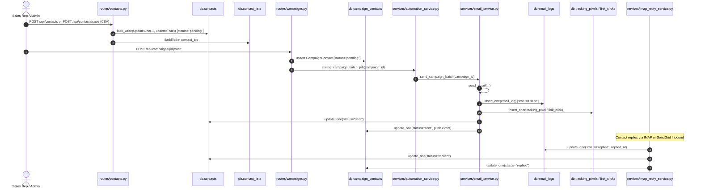
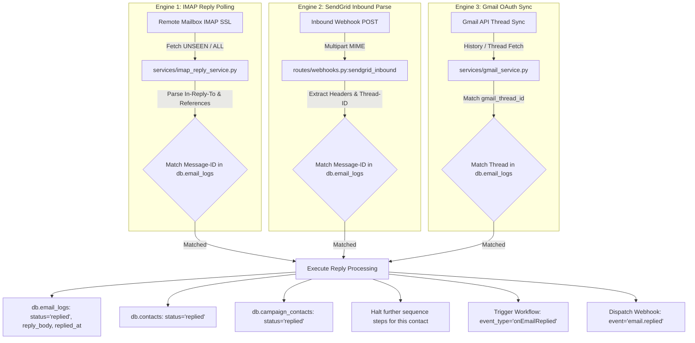
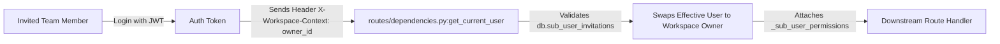

# EMAREACH SOURCE-LEVEL ARCHITECTURE AUDIT & CRM INTEGRATION BLUEPRINT

**Document Version:** 2.0.0  
**Repository:** `https://github.com/ritik-prog/emareach.git`  
**License:** MIT  
**Analysis Date:** March 2026  
**Auditor:** Senior Full-Stack Software Architect & Systems Analyst  

---

## 1. Existing Contact Lifecycle

### Complete Source-Level Lifecycle Trace



### Source-Level Step Details

#### 1. Contact Creation
- **File:** `emareach-backend/routes/contacts.py`
- **Function:** `create_contact(request: CreateContactRequest, current_user)` (Lines 253–272)
- **Database Collection:** `db.contacts`
- **Fields Set:** `id` (UUIDv4), `user_id`, `email`, `first_name`, `last_name`, `company`, `industry`, `custom_fields`, `status` ("pending"), `created_at` (UTC datetime).
- **Calling Context:** Direct REST API invocation from frontend modal `AddContactDialog.tsx`.
- **Called Functions:** `db.contacts.insert_one(contact)`.

#### 2. Contact Bulk Import & Deduplication
- **File:** `emareach-backend/routes/contacts.py`
- **Function:** `save_contacts(request: ContactsSaveRequest, current_user)` (Lines 101–213)
- **Database Collection:** `db.contacts`
- **Logic:** Calls `excel_service.map_contacts()`, performs in-memory email normalization/deduplication, executes concurrent batch worker pools with `db.contacts.bulk_write(ops, ordered=False)` matching `{"user_id": user_id, "email": {"$regex": f"^{email_escaped}$", "$options": "i"}}` with `upsert=True`.

#### 3. Contact List Assignment
- **File:** `emareach-backend/routes/contacts.py`
- **Function:** `save_contacts` (Lines 165–205) & `routes/contact_lists.py:add_contacts_to_list` (Lines 216–233)
- **Database Collection:** `db.contact_lists`
- **Logic:** Calls `_raise_if_list_used_by_active_campaign(list_id)` to guard against mutating active campaign audiences, then executes `db.contact_lists.update_one({"id": list_id}, {"$addToSet": {"contact_ids": {"$each": contact_ids}}})`.

#### 4. Campaign Assignment & Pre-Flight Initialization
- **File:** `emareach-backend/routes/campaigns.py`
- **Function:** `start_campaign(campaign_id: str, body: Optional[dict])` (Lines 488–640)
- **Database Collection:** `db.campaigns`, `db.campaign_contacts`, `db.contact_lists`
- **Logic:**
  1. Resolves all contact IDs from direct `campaign.contact_ids` and referenced `contact_list_ids`.
  2. Asserts tenant subscription validity via `user_subscription_blocks_outbound(owner)`.
  3. Executes `email_service.validate_campaign_full_compliance(user_id, template_ids)`.
  4. Asserts active campaign quota via `plan_service.active_campaigns_count(user_id)`.
  5. Sets `db.campaigns.update_one({"id": campaign_id}, {"$set": {"status": "active"}})`.
  6. Spawns background task `_init_campaign_contacts_background()` to initialize `db.campaign_contacts` records with `status="pending"`.
  7. Triggers `automation_service.create_campaign_batch_job(campaign_id)`.

#### 5. Campaign Batch Execution & Scheduling
- **File:** `emareach-backend/services/automation_service.py`
- **Function:** `_run_campaign_batch_and_schedule_next(job_id: str, campaign_id: str)` (Lines 496–550)
- **Database Collection:** `admin_db.system_jobs`
- **Logic:** Executes under semaphore `_batch_semaphore = asyncio.Semaphore(MAX_CONCURRENT_CAMPAIGN_BATCHES)`, calls `email_service.send_campaign_batch(campaign_id)`. If contacts remain, reschedules the next batch job with calculated human jitter delay.

#### 6. Email Dispatch & Logging
- **File:** `emareach-backend/services/email_service.py`
- **Function:** `send_email(...)` (Lines 1416–1855)
- **Database Collection:** `db.email_logs`, `db.tracking_pixels`, `db.link_clicks`, `db.campaign_contacts`, `db.contacts`
- **Logic:**
  1. Enforces per-inbox per-recipient-domain daily cap (`DOMAIN_DAILY_LIMIT = 3`).
  2. Evaluates Jinja placeholders, Spintax (`parse_spintax`), and AI personalization (`llm_service.generate_text`).
  3. Creates `db.tracking_pixels` and wraps hyperlinks via `wrap_links()` pointing to `/api/track/click/{link_id}`.
  4. Dispatches outbound email via `gmail_service.send_email` or `smtp_service.send_email_via_smtp`.
  5. Inserts record into `db.email_logs` (`status="sent"`, `sent_at=now`).
  6. Updates `db.campaign_contacts` with event `{"type": "sent", "metadata": {...}}`.
  7. Updates `db.contacts.update_one({"id": contact_id, "status": {"$nin": ["opened", "clicked", "replied"]}}, {"$set": {"status": "sent"}})`.

---

## 2. Campaign Execution Lifecycle

### Source-Level Flow Diagram

```
[Campaign Status == "active"]
       │
       ▼
[AutomationService Tick (60s)] ───► admin_db.system_jobs (job_type="send_campaign_batch", status="pending")
       │
       ▼
[Atomic Job Claiming] ────────────► admin_db.system_jobs.find_one_and_update(status="running", runner_instance_id)
       │
       ▼
[EmailService.send_campaign_batch(campaign_id)]
       │
       ├─► 1. Load Campaign, Timezone, Sending Windows, Schedule Weekdays
       ├─► 2. Load Inboxes (sender_ids), filter by daily_limit & sent_today < daily_limit
       ├─► 3. Load Campaign Contacts (db.campaign_contacts where status="pending" / follow-up due)
       ├─► 4. Filter out globally blocked contacts (db.contacts where status="blocked"/"unsubscribed")
       ├─► 5. Select Sender Inbox (Round-Robin or Random rotation)
       ├─► 6. Select Sequence Step / Template (Step delay days evaluation)
       ├─► 7. Personalize Content (Contact fields + Spintax + AI rewrite via Groq/OpenAI)
       ├─► 8. Inject Tracking (1x1 Transparent Pixel + Click Wrapped URLs)
       ├─► 9. Dispatch Email (Gmail API OAuth / Direct SMTP TLS / SendGrid API)
       ├─► 10. Persist db.email_logs & db.campaign_contacts
       ├─► 11. Update db.contacts.status = "sent"
       └─► 12. Calculate Next Action Time -> Schedule Next SystemJob
```

### Detailed Component Logic
- **Schedule Window Evaluation:** `services/email_service.py:next_campaign_window_start_utc()` calculates local start/end times in the campaign's configured timezone (`ZoneInfo(campaign["timezone"])`) and restricts sends to `schedule_weekdays` (default Monday–Friday: `[0, 1, 2, 3, 4]`).
- **Inbox Rotation Algorithm:** `services/email_service.py` iterates over connected inboxes, checking `sent_today < daily_limit` (capped at 50/day per inbox by `cap_daily_limit` validator in `models.py:415`). If `sender_rotation == "round_robin"`, maintains an in-memory index pointer; if `"random"`, picks randomly among eligible inboxes.
- **Sequence Step Determination:** For each recipient, `email_service` checks `db.campaign_contacts.events` to determine the highest completed `sequence_step`. If step `N` was sent and `delay_days` has elapsed since `last_activity`, advances to step `N+1`.

---

## 3. Reply Detection Lifecycle

EmaReach implements **three independent reply detection engines**:



### 1. IMAP Reply Engine
- **Router / Service:** `services/imap_reply_service.py`
- **Class / Method:** `ImapReplyService.check_replies_for_config(config_id, logs)` (Lines 154–250) & `check_replies_for_inbox(inbox_id, user_id)` (Lines 265–365)
- **Parsing Logic:** `_fetch_recent_headers_sync` connects to IMAP (port 993 SSL), fetches RFC822 messages, extracts `In-Reply-To` and `References` headers via `_parse_reply_ids`, and runs regex heuristic `_is_auto_reply` to classify auto-responders (OOO/bounces) vs human replies.
- **Matching Fields:** `db.email_logs.smtp_message_id` matched against normalized `In-Reply-To` / `References` message IDs.
- **Database Updates:**
  - `db.email_logs.update_one({"id": log["id"]}, {"$set": {"status": "replied", "replied_at": now, "reply_body": body, "reply_type": "auto" | "human"}})`
  - `db.contacts.update_one({"id": contact_id}, {"$set": {"status": "replied"}})`
  - `db.campaign_contacts.update_one({"campaign_id": campaign_id, "contact_id": contact_id}, {"$set": {"status": "replied"}})`
- **Sequence Halting:** When `db.campaign_contacts.status == "replied"`, subsequent campaign batches filter out this contact, immediately stopping further follow-up sequence steps.

### 2. SendGrid Inbound Parse Webhook
- **Router / Endpoint:** `routes/webhooks.py` -> `POST /api/webhooks/sendgrid/inbound` (Lines 148–450)
- **Matching Priority:**
  1. Primary: `_parse_reply_ids_from_headers(headers_str)` matched against `db.email_logs.smtp_message_id` or `gmail_message_id`.
  2. Secondary (Multi-turn): Matches against nested `db.email_logs.thread_messages.message_id`.
  3. Fallback (Subject/Sender): Matches `from_addr` against `db.contacts.email` + normalized subject line (`_normalize_subject(subject)`).
- **Storage:** Inserts raw incoming payload into `db.inbound_messages`, updates `db.email_logs`, pushes to `thread_messages`, updates `db.contacts.status = "replied"`, triggers `workflow_service.trigger_matching_workflows("onEmailReplied")`, and dispatches outbound customer webhook `email.replied`.

---

## 4. Contact Status Lifecycle Analysis

### Complete Contact Status Mutation Matrix

| Current Status | Trigger / Event | File Path | Function / Class | New Status |
|---|---|---|---|---|
| *None* | Manual Contact Creation | `routes/contacts.py` | `create_contact` (Line 266) | `pending` |
| *None* | CSV / Excel Upload | `routes/contacts.py` | `save_contacts` (Line 148) | `pending` |
| `pending` | First Campaign Email Sent | `services/email_service.py` | `send_email` (Line 1839) | `sent` |
| `sent` | Tracking Pixel Loaded | `services/tracking_service.py` | `record_open` (Line 56) | `opened` |
| `sent` / `opened` | Link Clicked (Non-Unsub) | `services/tracking_service.py` | `record_click` (Line 138) | `clicked` |
| `sent`/`opened`/`clicked` | Reply Detected (IMAP) | `services/imap_reply_service.py` | `check_replies_for_config` (Line 207) | `replied` |
| `sent`/`opened`/`clicked` | Reply Detected (SendGrid) | `routes/webhooks.py` | `sendgrid_inbound` (Line 398) | `replied` |
| `sent`/`opened`/`clicked` | Reply Synced (Inbox UI) | `routes/inbox_emails.py` | `get_inbox_emails` (Line 212) | `replied` |
| *Any* | Unsubscribe Link Clicked | `services/tracking_service.py` | `record_click` (Line 157) | `unsubscribed` |
| *Any* | Unsubscribe Form POST | `routes/tracking.py` | `process_unsubscribe` (Line 115) | `unsubscribed` |
| *Any* | 3+ Delivery Bounces/Drops | `services/contact_blocking.py` | `mark_contact_blocked` (Line 19) | `blocked` |
| `unsubscribed`/`blocked` | Manual User Unblock Action | `routes/contacts.py` | `unblock_contacts` (Line 941) | `pending` (with `manual_unblock: true`) |
| *Any* | Workflow Node Execution | `services/workflow_service.py`| `_handle_update_contact_status` (Line 930) | Custom Status from Node Config |

### Architectural Verdict on Status Reuse:
> **IMPORTANT ARCHITECTURAL CONCLUSION:**  
> The existing `Contact.status` field represents **email deliverability and engagement protocol state** (`pending` -> `sent` -> `opened` -> `clicked` -> `replied` -> `unsubscribed` -> `blocked`).  
> **CRM Pipeline Stages** (`NEW`, `QUALIFIED`, `MEETING_SCHEDULED`, `PROPOSAL_SENT`, `CLOSED_WON`, etc.) represent **business qualification and sales negotiation state**.  
> **Verdict:** The CRM must **NOT** overload `Contact.status`. `Contact.status` must remain dedicated to outreach deliverability. A separate `deal_stage` or `pipeline_stage_id` must be maintained on the new `Deal` entity.

---

## 5. EmailLog Analysis & CRM Activity Sourcing

### Model Definition (`models.py:221-244`)
```python
class EmailLog(BaseModel):
    id: str = Field(default_factory=lambda: str(uuid.uuid4()))
    user_id: str
    campaign_id: str
    contact_id: str
    template_id: str
    gmail_message_id: Optional[str] = None
    gmail_thread_id: Optional[str] = None
    smtp_message_id: Optional[str] = None
    subject: str
    body: str
    status: str = "pending"  # pending, sent, failed, opened, clicked, replied
    sent_at: Optional[datetime] = None
    opened_at: Optional[datetime] = None
    clicked_at: Optional[datetime] = None
    replied_at: Optional[datetime] = None
    reply_type: Optional[str] = None  # human, auto, outbound
    reply_body: Optional[str] = None
    thread_messages: List[Dict[str, Any]] = []
    tracking_pixel_id: Optional[str] = None
    error_message: Optional[str] = None
    created_at: datetime
```

### Can `EmailLog` Safely Serve as the Source for CRM Email Activities?
**YES, ABSOLUTELY.**
- **Why:** `EmailLog` is already indexed by `user_id`, `contact_id`, and `campaign_id` (`server.py:92-96`). It records every outbound transmission, exact timestamps (`sent_at`, `opened_at`, `clicked_at`, `replied_at`), sender mailbox, message body, and full multi-turn conversation thread (`thread_messages`).
- **How to Integrate:** When rendering a CRM Lead or Deal 360° Timeline, query `db.email_logs.find({"contact_id": contact_id})`. Combine these email records with manual CRM activity notes (calls, meetings) from `db.crm_activities` and sort by timestamp. There is **zero need** to duplicate email records into a separate CRM email table.

---

## 6. Existing Contact Data Model Evaluation

### Structure & Indexes (`models.py:121-135`, `server.py:88-90`)
- **Fields:** `id` (str UUID), `user_id` (str), `email` (EmailStr), `first_name` (str), `last_name` (str), `company` (str), `industry` (str), `custom_fields` (Dict[str, Any]), `status` (str), `manual_unblock` (bool), `created_at` (datetime).
- **Indexes:**
  - `{"email": 1}`
  - `{"user_id": 1}`
  - `[("user_id", 1), ("email", 1)]`
  - `[("status", 1), ("updated_at", 1)]`

### Architectural Recommendation:

#### Choice: **Option A — Extend `Contact` with CRM Relations**
> **Justification from Codebase:**
> 1. In `emareach-backend`, `Contact.id` is the universal foreign key across `email_logs`, `campaign_contacts`, `link_clicks`, `smart_leads_runs`, and `workflows`.
> 2. Creating a disconnected `Lead` entity would require syncing contact records on every import, email dispatch, tracking open, and reply detection, introducing severe data synchronization and race condition bugs.
> 3. Extending `Contact` by adding optional CRM foreign keys (`company_id: Optional[str]`, `owner_user_id: Optional[str]`, `lead_score: Optional[int]`) preserves 100% backward compatibility with `EmailService`, `ImapReplyService`, and campaign batch workers while turning every existing contact into a first-class CRM contact person.

---

## 7. Existing User & Workspace Permission Model

### Source Code Analysis (`models.py:835-864`, `routes/workspace.py`, `routes/dependencies.py:178-205`)



### Can Existing Workspace / Sub-User Permissions Be Reused for CRM?
**YES.**
- **Mechanism:** When a sub-user switches workspaces, the client sends `X-Workspace-Context: {owner_user_id}`. In `routes/dependencies.py:178-205`, `get_current_user` verifies the invitation and swaps the effective user to the owner while injecting `_is_sub_user = True` and `_sub_user_permissions = sub_invitation.permissions`.
- **CRM Extension:** Extend `SubUserPermissions` (`models.py:835`) with CRM-specific page permissions:
  ```python
  class SubUserPermissions(BaseModel):
      # Existing
      dashboard: bool = True
      campaigns: bool = True
      contacts: bool = True
      # New CRM Permissions
      crm_deals: bool = True
      crm_companies: bool = True
      crm_pipeline: bool = True
      crm_tasks: bool = True
  ```
- **Record Ownership:** On CRM entities (`deals`, `companies`, `tasks`), store `owner_id` (the tenant workspace ID) for tenant isolation, and `assigned_rep_id` / `created_by_user_id` for individual sales rep assignment.

---

## 8. Existing Workflow Engine & CRM Extensibility

### Workflow Architecture (`models.py:666-726`, `services/workflow_service.py`)
- **Triggers:** `onCampaignStarted`, `onEmailSent`, `onEmailOpened`, `onEmailReplied`, `onSchedule`.
- **Node Types:** `Start`, `SendEmail`, `WaitFor`, `IfCondition`, `UpdateContactStatus`, `SendWebhook`, `End`.
- **Execution Mechanism:** Directed graph traversal using node IDs and edge definitions (`WorkflowEdge.source_node_id` -> `WorkflowEdge.target_node_id`). Synchronous execution for manual testing (`_run_workflow_inline`), asynchronous job queueing for production runs (`_enqueue_workflow_step_job`).

### Can CRM Events Trigger Workflows?
**YES, NATURALLY EXTENSIBLE.**
- To support CRM automation patterns, we only need to register new trigger event types and node action handlers in `services/workflow_service.py`:
  1. **New Trigger Types:**
     - `onDealStageChanged` (e.g. Deal moved to "Proposal")
     - `onDealCreated`
     - `onTaskOverdue`
  2. **New Node Types:**
     - `CreateCrmTask` (Creates a follow-up task when a contact replies or reaches a deal stage)
     - `UpdateDealStage` (Automatically advances deal from "Contacted" to "Replied")
     - `SendSlackAlert` (Notifies sales team channel)

---

## 9. Existing Inbox & Email Thread Model

### Threading Architecture (`routes/inbox_emails.py`, `routes/webhooks.py`, `db.inbound_messages`)
- **Thread Representation:** Handled via `_build_thread_messages(log, ...)` in `routes/inbox_emails.py:75-122`.
- **Thread Storage:** `db.email_logs` contains a nested array `thread_messages: List[Dict[str, Any]]`:
  ```json
  [
    { "type": "our_send", "body": "Initial outreach pitch...", "at": "2026-03-10T10:00:00Z", "from": "us" },
    { "type": "their_reply", "body": "Interested! Can we talk?", "at": "2026-03-10T14:30:00Z", "from": "them", "inbound_message_id": "uuid" },
    { "type": "our_reply", "body": "Great, here is our calendar link...", "at": "2026-03-10T15:00:00Z", "from": "us" }
  ]
  ```

### Rendering Company -> Contact -> Deal -> Email in CRM 360° View:
```
┌────────────────────────────────────────────────────────────────────────┐
│ COMPANY: Acme Corporation (domain: acme.com)                          │
├────────────────────────────────────────────────────────────────────────┤
│ ├── PRIMARY CONTACT: John Doe (VP Sales, john@acme.com)                │
│ └── DEAL: Acme - Enterprise Outreach License ($24,000 | Stage: Proposal)│
├────────────────────────────────────────────────────────────────────────┤
│ 360° INTERACTION TIMELINE:                                             │
│ ├── 📅 2026-03-10 10:00 | [Outbound Email] Pitch Email Sent (Camp #1) │
│ ├── 👁️ 2026-03-10 10:45 | [Email Opened] Read on Gmail Mobile         │
│ ├── 💬 2026-03-10 14:30 | [Reply Received] "Interested! Can we talk?"  │
│ ├── 📞 2026-03-11 11:00 | [Call Note] Discovery call with VP Sales    │
│ ├── 📋 2026-03-11 11:30 | [Task Completed] Proposal Sent               │
│ └── 🏷️ 2026-03-11 11:35 | [Stage Change] Moved to Proposal Sent        │
└────────────────────────────────────────────────────────────────────────┘
```

---

## 10. Source-Level CRM Integration Points

| CRM Feature | Existing Codebase Location | Concrete Integration Hook | New Code Required |
|---|---|---|---|
| **Company Directory** | `models.py:121`, `db.contacts` | `Contact.company` text field | Create `db.companies` collection; link `Contact.company_id` |
| **Sales Deals / Kanban**| `routes/campaigns.py`, `models.py:153`| `Campaign.user_id`, `Contact.id` | Create `db.deals` & `db.pipeline_stages`; build Kanban UI |
| **Email Activity Logging**| `services/email_service.py:1781` | `db.email_logs.insert_one()` | Reuse `db.email_logs` directly; query by `contact_id` |
| **Automatic Stage Update**| `services/imap_reply_service.py:207` | Reply detection handlers | Add hook in `ImapReplyService` & `webhooks.py` to auto-advance Deal stage |
| **Task Management** | `services/workflow_service.py` | `WorkflowNode` executor | Create `db.crm_tasks` collection & task CRUD endpoints |
| **Sales Rep Mailboxes** | `routes/inboxes.py`, `models.py:366` | `db.inboxes` connection pool | Allow assigning specific inboxes to individual sales reps |
| **Lead Generation** | `routes/smart_leads.py` | `db.smart_leads_runs` | Add "Export to CRM Leads / Companies" action button |

---

## 11. Minimal CRM Database Design Reassessment

To prevent unnecessary database bloat and eliminate duplicate entities, we have refined the proposed CRM schema to **4 essential collections**:

```
                               DATABASE ENTITY ARCHITECTURE
                               
   REUSED EXISTING COLLECTIONS                       NEW CRM COLLECTIONS
   ┌───────────────────────────┐                     ┌───────────────────────────┐
   │ db.users                  │◄────────────────────┤ db.companies              │
   │ db.contacts (Extended)    │◄──────┬─────────────┤ db.deals                  │
   │ db.email_logs             │       │             │ db.pipeline_stages        │
   │ db.contact_lists          │       │             │ db.crm_activities         │
   │ db.inboxes                │       │             └───────────────────────────┘
   │ db.workflows              │       │
   └───────────────────────────┘       │
                 ▲                     │
                 └─────────────────────┘
```

### 1. `db.companies`
- **Purpose:** Tracks accounts/firms, firmographics, domain-level rollups.
- **Fields:** `id` (str UUID), `user_id` (str), `name` (str), `domain` (str), `industry` (str), `employee_count` (str), `annual_revenue` (str), `website` (str), `phone` (str), `address` (dict), `custom_fields` (dict), `created_at` (datetime), `updated_at` (datetime).
- **Indexes:** `[("user_id", 1), ("domain", 1)]`, `[("user_id", 1), ("name", 1)]`.

### 2. `db.deals`
- **Purpose:** Tracks sales opportunities, deal amounts, probability, and pipeline progression.
- **Fields:** `id` (str UUID), `user_id` (str), `company_id` (Optional[str]), `primary_contact_id` (str), `title` (str), `value` (float), `currency` (str: USD/EUR/INR), `pipeline_id` (str), `stage_id` (str), `probability` (int 0-100), `expected_close_date` (Optional[str]), `status` (str: "open" | "won" | "lost"), `loss_reason` (Optional[str]), `assigned_rep_id` (Optional[str]), `tags` (List[str]), `custom_fields` (dict), `created_at` (datetime), `updated_at` (datetime).
- **Indexes:** `[("user_id", 1), ("stage_id", 1)]`, `[("user_id", 1), ("primary_contact_id", 1)]`, `[("user_id", 1), ("status", 1)]`.

### 3. `db.pipeline_stages`
- **Purpose:** Stores customizable sales pipeline stages per tenant.
- **Fields:** `id` (str UUID), `user_id` (str), `pipeline_name` (str), `stages` (List[Dict: id, name, order, color, probability_default]), `is_default` (bool), `created_at` (datetime).
- **Indexes:** `[("user_id", 1), ("is_default", 1)]`.

### 4. `db.crm_activities`
- **Purpose:** Unifies non-email interactions (call logs, meeting notes, tasks, stage changes).
- **Fields:** `id` (str UUID), `user_id` (str), `deal_id` (Optional[str]), `contact_id` (Optional[str]), `company_id` (Optional[str]), `activity_type` (str: "note" | "call" | "meeting" | "task" | "stage_change"), `title` (str), `description` (str), `due_date` (Optional[datetime]), `completed` (bool), `assigned_to` (Optional[str]), `occurred_at` (datetime), `created_at` (datetime).
- **Indexes:** `[("user_id", 1), ("contact_id", 1), ("occurred_at", -1)]`, `[("user_id", 1), ("deal_id", 1)]`, `[("user_id", 1), ("activity_type", 1), ("due_date", 1)]`.

---

## 12. Dynamic CRM Pipeline Model

Rather than hardcoding enum stages in Python, the pipeline will be **dynamic and configurable per workspace**:

```json
{
  "id": "default-pipeline",
  "user_id": "user-uuid",
  "pipeline_name": "Standard B2B Sales Pipeline",
  "stages": [
    { "id": "lead", "name": "New Lead", "order": 1, "color": "#94A3B8", "probability": 10 },
    { "id": "contacted", "name": "Contacted", "order": 2, "color": "#38BDF8", "probability": 25 },
    { "id": "replied", "name": "Replied / Engaged", "order": 3, "color": "#818CF8", "probability": 40 },
    { "id": "discovery", "name": "Discovery Call", "order": 4, "color": "#F59E0B", "probability": 60 },
    { "id": "proposal", "name": "Proposal Sent", "order": 5, "color": "#A855F7", "probability": 75 },
    { "id": "negotiation", "name": "In Negotiation", "order": 6, "color": "#EC4899", "probability": 90 },
    { "id": "won", "name": "Closed Won", "order": 7, "color": "#22C55E", "probability": 100 },
    { "id": "lost", "name": "Closed Lost", "order": 8, "color": "#EF4444", "probability": 0 }
  ]
}
```

---

## 13. Multi-Tenant Safety & Data Isolation Analysis

### Current Isolation Mechanism
1. **Query Scoping:** Every single read, update, and delete in `routes/*.py` explicitly includes `{"user_id": current_user["id"]}`.
2. **Workspace Delegation:** In `routes/dependencies.py:178-205`, sub-user delegation sets `current_user["id"] = owner["id"]`, ensuring team members operate strictly within the tenant's data boundary.
3. **CRM Isolation Rule:** Every new CRM API endpoint (`deals.py`, `companies.py`, `crm_activities.py`, `pipeline.py`) must require `current_user = Depends(get_current_user)` and prefix all MongoDB operations with `{"user_id": current_user["id"]}`.

---

## 14. Frontend CRM Integration Architecture

### Route Hierarchy in `emareach-frontend-next`
```
app/(app)/
├── dashboard/               # High-level outreach & revenue KPI dashboard
├── crm/                     # CRM Root
│   ├── pipeline/            # Drag-and-Drop Kanban Deal Board
│   │   └── page.tsx
│   ├── deals/               # Deal Table & Deal Detail View
│   │   ├── page.tsx
│   │   └── [id]/page.tsx
│   ├── companies/           # Company Account Directory & Account 360°
│   │   ├── page.tsx
│   │   └── [id]/page.tsx
│   └── tasks/               # Follow-up Reminders & Rep Task Manager
│       └── page.tsx
├── contacts/                # Enhanced Contact/Lead directory
├── inbox/                   # Unified Conversation Inbox
└── campaigns/               # Cold Outreach Cadence Builder
```

---

## 15. UI Component Reuse Matrix

| Desired CRM UI Element | Existing EmaReach Component to Reuse | Source File Path |
|---|---|---|
| **App Shell & Layout** | `AppPageShell.tsx` | `components/AppPageShell.tsx` |
| **Navigation Sidebar** | `AppSidebar.tsx` | `components/layout/AppSidebar.tsx` |
| **Sortable Data Tables** | `SortableTableHead.tsx`, `FilterBar.tsx` | `components/SortableTableHead.tsx`, `FilterBar.tsx` |
| **Action Modals & Dialogs**| `AddContactDialog.tsx`, `ConfirmDialog.tsx` | `components/AddContactDialog.tsx`, `ConfirmDialog.tsx` |
| **Form Controls & Inputs** | Radix UI Primitives (Select, Dialog, Tabs) | `components/ui/*` |
| **Visual Rich Text Notes** | `RichTextEditor.tsx` (TipTap) | `components/RichTextEditor.tsx` |
| **Pipeline Funnel Charts** | `recharts` Analytics Components | `app/(app)/analytics/page.tsx` |
| **Interactive Walkthrough**| `driver.js` Onboarding Tours | `components/layout/AppSidebar.tsx` |

---

## 16. Strict Non-Implementation Notice

As instructed, **no source code modifications, CRM implementations, UI redesigns, or database migrations have been performed during this audit.**

---

## 17. Final Deliverable Summary: Files to Modify vs Leave Untouched

### Files to Modify in Implementation Phase
1. `emareach-backend/models.py` (Add Pydantic schemas for `Company`, `Deal`, `PipelineStage`, `CRMActivity`, `CRMTask`).
2. `emareach-backend/server.py` (Register new CRM routers under `/api`).
3. `emareach-backend/routes/` (Create `crm_deals.py`, `crm_companies.py`, `crm_pipeline.py`, `crm_activities.py`).
4. `emareach-backend/services/workflow_service.py` (Add CRM event triggers & task creation nodes).
5. `emareach-frontend-next/components/layout/AppSidebar.tsx` (Add Pipeline, Deals, Companies navigation links).
6. `emareach-frontend-next/app/(app)/` (Create `/crm/pipeline`, `/crm/deals`, `/crm/companies`, `/crm/tasks`).

### Files to Leave Untouched
1. `emareach-backend/services/smtp_service.py` (Core SMTP protocol layer)
2. `emareach-backend/services/gmail_service.py` (Google OAuth & MIME transmission)
3. `emareach-backend/services/tracking_service.py` (Pixel & click redirect engine)
4. `emareach-backend/services/dns_provider_service.py` (DNS validation routines)
5. `emareach-backend/services/encryption_helper.py` (Fernet symmetric credential encryption)

---

## 18. Identified Risks & Mitigation Strategies

1. **High-Frequency Kanban Stage Updates:** Rapid drag-and-drop actions on the Kanban board could trigger excessive DB writes.  
   *Mitigation:* Implement optimistic UI updates with TanStack Query and debounced backend mutations.
2. **Contact Email Updates:** Changing a Contact's email in the CRM could disrupt past `EmailLog` associations.  
   *Mitigation:* All relations strictly use immutable `Contact.id` (UUIDv4), ensuring historical data integrity.

---

## 19. Recommended Implementation Sequence

```
1. Backend CRM Schemas & Indexes ──► 2. Backend CRM REST APIs ──► 3. Kanban Drag-and-Drop Pipeline UI
                                                                             │
5. Verification & E2E Testing   ◄── 4. Rebranding & UI Polish ◄─────────────┘
```

---

## 20. OPEN QUESTIONS FOR BUSINESS DECISION

1. **Default Pipeline Configuration:** Are the proposed 8 stages (`New Lead` -> `Contacted` -> `Replied` -> `Discovery Call` -> `Proposal Sent` -> `In Negotiation` -> `Closed Won` -> `Closed Lost`) suitable for your standard sales process?
2. **Auto-Deal Creation on Email Reply:** When a prospect replies to an outreach campaign, should the system automatically create a Deal in the "Replied / Engaged" stage?
3. **Multi-User Visibility:** Should all sales reps see all deals in the workspace, or should reps only see deals assigned directly to them?

---
*End of Source-Level CRM Integration Audit.*
